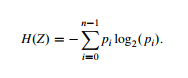

```{r setup, include=FALSE}
knitr::opts_chunk$set(echo = TRUE)
library(readr)
library(ggplot2)
library(knitr)
library(tidyverse)
library(sqldf)
library(ggcorrplot)
library(rpart)       # direct engine for decision tree application
library(caret)       # meta engine for decision tree application
library(rpart.plot)
install.packages('devtools', repos = 'http://cran.us.r-project.org')
library(devtools)
devtools::install_github('skinner927/reprtree')
library(reprtree)
library(DT)
library(glmnet)
library(nnet)
library(caTools) 
library(randomForest)
library(ROCR)
library(pROC)
```


# Bảng phân công nhiệm vụ

| STT |   Mã SV   |     Họ và tên    |                Nhiệm vụ                                                                              |
|-----|-----------|------------------|------------------------------------------------------------------------------------------------------|
|  1  |  21133013 | Đỗ Ngọc Chí Công | - Tiền xử lý dữ liệu kiểm tra có giá trị na hay không; và chuyển chuỗi thành số cho hai tập dữ liệu. \
                                       - Vẽ biểu pie thể hiện tỷ trọng cho các giá trị cho các thuộc tính cho tập dữ liệu đầu tiên. \ Vẽ biểu đồ cột thể hiện giá trị M và B cho tập dữ liệu thứ hai, vẽ biểu đồ tương quan cho tập dữ liệu thứ hai. \
- Giải quyết bài toán: Xây dựng mô hình dự đoán khối u là lành tính hay ác tính thông qua các chỉ số được nhập vào sử dụng RandomForest \
- Tổng hợp file R Markdown. |
|  2  |  21133059 | Trần Sĩ Nguyên   | - Vẽ các biểu đồ: \ Thống kế thời gian sống kể từ mắc bệnh theo tình trạng hôn nhân của những bênh nhân tử vong \ Thống kế thời gian sống kể từ mắc bệnh theo màu da của những bênh nhân tử vong \ . Giải quyết bài toán: Bài toán: Tạo mô hình để dự đoán Status(Dead or Alive) dựa trên Age, Estrogen.Status, X6th.Stage, Survival.Months sử dụng desicion tree.   |
|  3  |  21133006 | Phan Cao Bằng    | - Vẽ các biểu đồ: \ Biều đồ phân phối của trạng thái (Survived và Died) dưới sự ảnh hưởng của biến T.Stage và Age (Stacked Bar Chart). \ Biều đồ so sánh sự chệnh lệch của các trạng thái (Status) và thể hiện mối quan hệ giữa các biếnAge, Survival.Months, T.Stage, N.Stage, Status (Scatter Plot) \ .Giải quyết bài toán: Tạo ra mô hình để kiểm tra các thuộc tính: Dự đoán Sống hoặc Chết của người bệnh Ung thư vú dựa vào các nhân tố như Tuổi, Chủng tộc, Tình trạng Es/Pro và một số nhân tố khác có trong tệp dữ liệu sử dụng hồi quy Logarit.|
|  4  |  21133031 | Huỳnh Gia Hân    | - Tìm hiểu dữ liệu \
		- Vẽ biểu đồ thể hiện bán kính khối u, bán kinh sai số chuẩn khối u và bán kinh lớn nhất mà khối u có thể đạt được cho tập dữ liệu thứ hai (histogram). \
		- Vẽ biểu đồ thể hiện sự tương quan giữa của compactness_mean, concavity_mean, fractal_dimension_mean của tập dữ liệu thứ hai (bubble chart).\
		- Vẽ các biểu đồ cho kiểm định giả thuyết (Stacked bar)\
		- Làm các bài kiểm định giả thuyết.\
		- Tổng hợp file PowerPoint |

# Phần 1. Thông tin về các tập dữ liệu:
### 1.1. Ung thư vú của SEER.

https://www.kaggle.com/datasets/reihanenamdari/breast-cancer

  * Tập dữ liệu về bệnh nhân ung thư vú này được lấy từ bản cập nhật tháng 11 năm 2017 của Chương trình SEER của NCI, nơi cung cấp thông tin về thống kê ung thư dựa trên dân số. Bộ dữ liệu liên quan đến các bệnh nhân nữ bị ung thư vú ung thư biểu mô ống xâm nhập và ung thư biểu mô tiểu thùy (SEER trích dẫn chính mã lại mã mô học NOS 8522/3) được chẩn đoán vào năm 2006-2010. Những bệnh nhân có kích thước khối u không rõ, LN khu vực được kiểm tra, LN khu vực dương tính và những bệnh nhân có tháng sống sót dưới 1 tháng đã bị loại trừ. Và, 4024 bệnh nhân cuối cùng đã được đưa vào.
- Age: Độ tuổi.
- Race: Chủng tộc.
- Marital State: Tình trạng kết hôn.
- T Stage: 
  * Giai đoạn T trong ung thư vú đề cập đến kích thước và mức độ lan rộng của khối u nguyên phát và là thành phần quan trọng của hệ thống phân giai đoạn TNM được sử dụng để xác định giai đoạn tổng thể của bệnh. 
  T1 (Tumor size 1): Khối u có kích thước tối đa là 2 centimet (cm) trong chiều lớn nhất.
  T2 (Tumor size 2): Khối u có kích thước từ 2 cm đến 5 cm trong chiều lớn nhất.
  T3 (Tumor size 3): Khối u có kích thước lớn hơn 5 cm trong chiều lớn nhất.
  T4 (Tumor size 4): Có thể được chia thành các phụ giai đoạn T4a, T4b, T4c, và T4d:
    T4a: Khối u lan ra ngoài vú, nhưng không tác động lên cơ bắp hoặc 	da.
    T4b: Khối u lan ra ngoài vú và tác động lên cơ bắp.
    T4c: Khối u lan ra ngoài vú và tác động lên da, có thể bao gồm 	sưng, đau, và vẻ ngoại hình bất thường của da.
    T4d: Mọi giai đoạn của T4 có thể bao gồm sự lan truyền đến nút 	lymph cục.
- N Stage:
  * Giai đoạn N trong ung thư vú đề cập đến sự liên quan của các hạch bạch huyết ở nách (nách) và các khu vực khác gần vú, 
đồng thời đóng vai trò quan trọng trong việc xác định giai đoạn tổng thể và tiên lượng của bệnh. Trong hệ thống phân loại giai đoạn ung thư vú theo AJCC 6th, giá trị N (Node) chỉ ra mức độ lan truyền của ung thư đến các nút lymph cục xung quanh. Dưới đây là mô tả tổng quan về các giá trị N:
  N1 (Node 1): Sự lan truyền đến một hoặc nhiều nút lymph cục cục bộ.
  N2 (Node 2): Sự lan truyền có thể bao gồm một trong các điều kiện sau:
    Sự lan truyền đến 4-9 nút lymph cục cục bộ.
    Sự lan truyền đến nút lymph cục xa cách vú, nhưng không phải là 	nút lymph cục bên đối diện.
  N3 (Node 3): Sự lan truyền có thể bao gồm một trong các điều kiện sau:
    Sự lan truyền đến 10 nút lymph cục cục bộ trở lên.
  Sự lan truyền đến nút lymph cục bên đối diện của vú.
- 6th Stage:
  * Giai đoạn của ung thư vú theo hệ thống AJCC 6th được biểu diễn bằng các pha từ I đến IV, với mỗi giai đoạn được chia thành các phụ giai đoạn A, B, C, v.v., tùy thuộc vào một số yếu tố như kích thước của khối u, sự lan truyền đến nút lymph, và sự lan truyền đến các bộ phận khác của cơ thể. 
Các giá trị:
    IIA (Stage IIA): Đây là một giai đoạn trong hệ thống AJCC 6th và thường ám chỉ một mức độ lan truyền ở mức độ trung bình. Các yếu tố như kích thước của khối u và sự lan truyền đến nút lymph có thể đặc trưng cho giai đoạn này.
    IIB (Stage IIB): Giai đoạn này thường ám chỉ một mức độ lan truyền ở mức độ cao hơn so với IIA. Điều này có thể bao gồm các yếu tố như kích thước lớn hơn của khối u hoặc sự lan truyền đến nút lymph xa hơn.
    IIIA (Stage IIIA): Đây là một giai đoạn trong đó ung thư vú đã có mức độ lan truyền mạnh mẽ. Thông thường, các yếu tố như kích thước của khối u, sự lan truyền đến nút lymph cục, và vị trí của nút lymph cục bị ảnh hưởng đến việc xác định giai đoạn này. Ví dụ, giai đoạn IIIA có thể ám chỉ khối u lớn, có sự lan truyền đến nút lymph cục, nhưng không có sự lan truyền đến các cơ bản khác.
    IIIB (Stage IIIB): Giai đoạn IIIB thường ám chỉ một mức độ lan truyền mạnh mẽ hơn so với giai đoạn      IIIA, nhưng không đạt đến mức độ lan truyền của giai đoạn IIIC. Các yếu tố như kích thước của khối u, sự lan truyền đến nút lymph cục, và vị trí của nút lymph cục có thể được xem xét để xác định giai đoạn này.
    IIIC (Stage IIIC): Đây là một giai đoạn nâng cao, trong đó sự lan truyền của ung thư đã mở rộng đến nút lymph cục xa và có thể liên quan đến các cơ bản lân cận khác. Giai đoạn IIIC thường là một giai đoạn nâng cao, chỉ ra một mức độ lan truyền rất mạnh mẽ của ung thư.
- Differentiate:
  Điều này đề cập đến mức độ trưởng thành của các tế bào khối u. Các tế bào biệt hóa tốt giống với tế bào vú bình thường và có tiên lượng tốt hơn, trong khi các tế bào kém biệt hóa thì bất thường và hung hãn hơn.
- Grade:
  Trong ung thư vú, thuật ngữ “độ” dùng để chỉ mức độ trưởng thành hoặc sự biệt hóa của các tế bào khối u. Về cơ bản, nó là thước đo mức độ giống nhau của các tế bào ung thư với các tế bào vú bình thường.
Đánh giá tốc độ tế bào ung thư đang phân chia. Điểm số cụ thể từ mỗi đặc điểm này sau đó được cộng lại để xác định bậc độ tổng thể, theo các phân loại thông thường như Bậc độ 1 (tốt), Bậc độ 2 (trung bình), và Bậc độ 3 (kém).
(Và nó có phân chia các trường hợp, mình sẽ tìm hiểu thêm.)
- A Stage:
  Có 2 giá trị:
    Regional - Một khối u đã lan rộng
    Distant - Một khối u đã lan đến các bộ phận của cơ thể ở xa
- Tumor Size:
Kích thước khối u là yếu tố quan trọng quyết định giai đoạn và tiên lượng của bệnh ung thư vú. Nó được đo ở điểm rộng nhất và thường được báo cáo bằng milimét (mm) hoặc centimét (cm).
(Nó cũng được chia ra các thành phần nhỏ hơn mình sẽ tìm hiểu sau.)
- Estrogren Status:
Estrogen đóng một vai trò quan trọng trong sự phát triển và tiến triển của ung thư vú. Hiểu được tình trạng thụ thể estrogen  (ER) của khối u là rất quan trọng để xác định các chiến lược điều trị hiệu quả nhất. Các thụ thể estrogen là các protein được tìm thấy trong tế bào vú. Khi estrogen liên kết với các thụ thể này, nó sẽ báo hiệu cho các tế bào phát triển và phân chia. Các khối u có số lượng thụ thể estrogen cao được gọi là dương tính với thụ thể estrogen (ER+). Những khối u này dựa vào estrogen để phát triển và có khả năng đáp ứng với các loại thuốc trị liệu bằng hormone ngăn chặn tác dụng của estrogen.
- Progesterone Status:
  Các thụ thể progesterone là các protein được tìm thấy trong một số tế bào vú. Khi progesterone liên kết với các thụ thể này, nó có thể thúc đẩy sự phát triển và phân chia tế bào. Các khối u có số lượng thụ thể progesterone cao được gọi là dương tính với thụ thể progesterone (PR+). Những khối u này có thể bị ảnh hưởng bởi progesterone và có khả năng đáp ứng với liệu pháp hormone nhắm vào cả estrogen và progesterone. 
- Regional Node Examined:
  Trong ung thư vú, việc kiểm tra hạch vùng tùy thuộc vào giai đoạn và vị trí của khối u
- Reginol Node Positive
- Survival Months Status

### 1.2. Breast Cancer Wisconsin (Diagnostic).

https://www.kaggle.com/datasets/uciml/breast-cancer-wisconsin-data

*   Các đặc điểm được tính toán từ hình ảnh số hóa của chọc hút bằng kim nhỏ (FNA) của khối vú. Chúng mô tả đặc điểm của nhân tế bào có trong hình ảnh. n không gian 3 chiều được mô tả trong: [K. P. Bennett và O. L. Mangasarian: "Phân biệt lập trình tuyến tính mạnh mẽ của hai tập hợp tuyến tính không thể tách rời", Phương pháp tối ưu hóa và phần mềm 1, 1992, 23-34].

Attribute Information:

1) ID number
2) Diagnosis (M = malignant, B = benign)
3-32)
Mười tính năng có giá trị thực được tính toán cho mỗi nhân tế bào:

* radius (mean of distances from center to points on the perimeter) - bán kính (trung bình khoảng cách từ tâm đến các điểm trên chu vi)
* texture (standard deviation of gray-scale values) - kết cấu (độ lệch chuẩn của các giá trị thang độ xám) 
  Texture trong ung thư vú là một đặc trưng được sử dụng để phân tích biến đổi của các mẫu hình ảnh y tế. Để hiểu rõ hơn về texture, chúng ta có thể nói về độ lệch chuẩn (standard deviation) của các giá trị xám (gray-scale values). Trong hình ảnh y tế, các giá trị xám thường biểu thị mức độ sáng tối của các pixel. Độ lệch chuẩn là một chỉ số thống kê dùng để đo sự phân tán của dữ liệu. Trong trường hợp này, độ lệch chuẩn của các giá trị xám trong hình ảnh ung thư vú được sử dụng để đánh giá sự biến đổi trong mức độ sáng tối của các khu vực khác nhau trên hình ảnh. Thông thường, các vùng ung thư có xu hướng có texture không đều, không đồng nhất và thay đổi nhiều so với các vùng bình thường trong hình ảnh. Điều này có thể được phản ánh bằng độ lệch chuẩn lớn hơn của các giá trị xám trong các khu vực ung thư so với các khu vực bình thường.
* perimeter – Chu vi
* area – diện tích
* smoothness (local variation in radius lengths) - độ mịn (thay đổi cục bộ về độ dài bán kính)
Smoothness (độ mịn) trong ung thư vú là một đặc trưng hình học được sử dụng để đánh giá sự biến thiên cục bộ trong độ dài bán kính của các vùng trong hình ảnh y tế của ung thư vú.

Để hiểu rõ hơn về smoothness, chúng ta có thể nói về sự biến thiên cục bộ trong độ dài bán kính của các vùng trong hình ảnh ung thư vú. Thông thường, trong ung thư vú, các vùng bất thường hoặc ung thư thường có xu hướng có độ biến thiên cục bộ cao hơn so với các vùng bình thường.

Smoothness được đo bằng cách xác định sự khác biệt giữa các bán kính của các vùng lân cận nhau. Nếu sự khác biệt này nhỏ, tức là các vùng có độ mịn cao, có xu hướng ít biến đổi và liền mạch hơn. Ngược lại, nếu sự khác biệt lớn, tức là các vùng có độ mịn thấp, có xu hướng biến đổi đột ngột và không liền mạch.

* compactness (perimeter^2 / area - 1.0) - nhỏ gọn (chu vi ^ 2 / diện tích - 1.0)
Nếu một vùng có compactness gần với 0, điều đó cho thấy chu vi bình phương và diện tích của vùng tương đối tương đồng, tức là vùng đó có hình dạng gần như là một hình tròn hoặc hình vuông. Tuy nhiên, trong trường hợp ung thư vú, các vùng bất thường thường có compactness cao hơn. Điều này có nghĩa là chu vi bình phương của vùng lớn hơn đáng kể so với diện tích, cho thấy hình dạng của vùng không gọn gàng và có nhiều biến đổi.

* concavity (severity of concave portions of the contour) - lõm (mức độ nghiêm trọng của các phần lõm của đường viền)
Concavity (độ lõm) trong ung thư vú là một đặc trưng hình học được sử dụng để đánh giá mức độ lõm của các phần lõm trên đường viền của một vùng trong hình ảnh y tế.

Để hiểu rõ hơn về concavity, chúng ta có thể xem xét cách đo lường mức độ lõm của các phần trên đường viền. Trong trường hợp ung thư vú, các phần lõm thường là các vùng không đều và không liền mạch trên đường viền của khối u. Concavity được sử dụng để đo lường mức độ lõm này, và thường được đánh giá dựa trên các đặc trưng hình học của đường viền của vùng.


* concave points (number of concave portions of the contour) - điểm lõm (số phần lõm của đường viền)
Concave points (số lõm) trong ung thư vú là một đặc trưng hình học được sử dụng để đếm số lượng điểm lõm trên đường viền của một vùng trong hình ảnh y tế.

Để hiểu rõ hơn về concave points, chúng ta có thể xem xét cách đếm số lượng điểm lõm trên đường viền của một vùng. Trong trường hợp ung thư vú, các điểm lõm thường là các điểm trên đường viền của khối u mà có hình dạng lõm vào bên trong.

Số lượng concave points được sử dụng để đo lường mức độ lõm của đường viền và có thể cho thấy sự không đều và không liền mạch của vùng ung thư.

* symmetry – sự đối xứng 
* fractal dimension ("coastline approximation" - 1) - kích thước fractal ("xấp xỉ đường bờ " - 1)

Fractal dimension (kích thước fraktal) trong ung thư vú là một đặc trưng hình học được tính dựa trên khái niệm "xấp xỉ đường bờ" của một vùng trong hình ảnh y tế.

Để hiểu rõ hơn về fractal dimension, chúng ta có thể xem xét cách xấp xỉ đường bờ của vùng. Trong trường hợp ung thư vú, đường bờ của vùng thường có hình dạng không đều, rối ren, và có nhiều chi tiết phức tạp.

Fractal dimension được tính bằng cách áp dụng khái niệm "xấp xỉ đường bờ" vào vùng. Đầu tiên, đường bờ của vùng được xem như đường bờ của một hình fraktal, trong đó các chi tiết nhỏ hơn được lặp lại trên các tỷ lệ khác nhau. Sau đó, fractal dimension được tính bằng cách áp dụng phương pháp tính toán kích thước fraktal vào đường bờ của vùng.


# Phần 2. Ung thư vú của SEER.

## 2.1. Trích xuất và đọc dữ liệu
* Trích xuất dữ liệu
```{r}
data <- read.csv("./Data/1_Breast_Cancer.csv")
datatable(data,filter = 'top', options = list(pageLength = 5, autoWidth = TRUE))
```
* Tóm tắt dữ liệu
```{r}
datatable(summary(data), options = list(pageLength = 5, autoWidth = TRUE))
```
## 2.2. Tiền xử lý dữ liệu
* Sao chép dữ liệu để xử lý dữ liệu trên bản sao không gây ảnh hưởng đến dữ liệu gốc.
```{r}
data_temp<-data
df <- data
```
* Kiểm tra xem có tồn tại giá trị na không?
```{r}
if(length(data[is.na(data)])==0){
  print("Không tồn tại gía trị na")
}else{
  print("Tồn tại giá trị na")
}
```
* Tiến hành lưu từng loại giá trị với cột giá trị tương ứng.
```{r}
Race_t<-c(sqldf("select distinct Race from data"))
Marital_Status_t<-c(sqldf("select distinct `Marital.Status` from data"))
T_Stage_t<-c(sqldf("select distinct `T.Stage` from data"))
N_Stage_t<-c(sqldf("select distinct `N.Stage` from data"))
X6th_Stage_t<-c(sqldf("select distinct `X6th.Stage` from data"))
differentiate_t<-c(sqldf("select distinct differentiate from data"))
Grade_t<-c(sqldf("select distinct Grade from data"))
A_Stage_t<-c(sqldf("select distinct `A.Stage` from data"))
Estrogen_Status_t<-c(sqldf("select distinct `Estrogen.Status` from data"))
Progesterone_Status_t<-c(sqldf("select distinct `Progesterone.Status` from data"))
Status_t<-c(sqldf("select distinct Status from data"))

list_data<- list(Race_t,Marital_Status_t,T_Stage_t,N_Stage_t,X6th_Stage_t,differentiate_t,Grade_t,A_Stage_t,Estrogen_Status_t,Progesterone_Status_t,Status_t)
```

* Tiến hành in ra các loại giá trị có trong từng cột.
```{r}
for(i in 1:length(list_data)){
  print(list_data[[i]])
}
```
* Ánh xạ và cập nhật dữ liệu chữ thành số.
- Ánh xạ dữ liệu
```{r,warning=FALSE}
data_copy <- data
AnhXa<-function (object,dk=""){
  name_c<-names(object)
  object_sp <- str_split(object[[1]]," ")
  for(i in 1:length(object_sp)){
    if(length(object_sp[[i]])>1){
      object_sp[i]<-str_remove(object_sp[[i]],"\" ")
      object_sp[i]<-paste(object_sp[i],"")
    }
    object_sp[i]<-paste(object_sp[i],dk,sep='')
  }
  len <- length(object_sp)
  print(paste("Cập nhật giá trị cột",name_c))
  print(object[[1]])
  print("Các giá trị tương ứng")
  print(1:len)
  print("------------------------------------")
  #update
  for(i in 1:len){
    query <- paste("update data_copy set ",paste("`",name_c,"`",sep=''),"=",i,"where ",paste("`",name_c,"`",sep=''),"=",str_replace(paste("'",object_sp[i],"'",sep=''),"\"c",""))
    data_copy <- sqldf(c(query, "select * from data_copy"))
  }
  data_copy
}
for(i in 1:length(list_data)){
  if(i!=6){
    data_copy<-AnhXa(list_data[[i]])
  }else{
    data_copy<-AnhXa(list_data[[i]],"differentiated")
  }
}
```

- Cập nhật dữ liệu chữ số thành số.
```{r,warning=FALSE}
name_c<-colnames(data_copy)
for(i in 1:length(name_c)){
  data_copy[name_c[i]]<-list(as.integer(unlist(data_copy[name_c[i]])))
}
datatable(data_copy,filter = 'top', options = list(pageLength = 5, autoWidth = TRUE))
```


* Lưu biến dữ liệu:
```{r}
data_temp<-data #Lưu trữ đẻ tránh bị biến đổi
rows_with_null <- data[!complete.cases(data), ]
data_dead <- data[data$Status=='Dead',]
datatable(data_dead,filter = 'top', options = list(pageLength = 5, autoWidth = TRUE))
```


## 2.3. Hiển thị dữ liệu lên biểu đồ

*  Thống kế thời gian sống kể từ mắc bệnh theo tình trạng hôn nhân của những bênh nhân tử vong
```{r}
ggplot(data_dead,aes(x=Marital.Status,y=Survival.Months,fill=Marital.Status))+
  geom_boxplot(outlier.colour="red")
```

* Thống kế thời gian sống kể từ mắc bệnh theo màu da của những bênh nhân tử vong
```{r}
ggplot(data_dead,aes(x=Race,y=Survival.Months,fill=Race))+
  geom_boxplot(outlier.colour="red")
```


```{r}
# Scatter plot giữa Age và Survival.Months
ggplot(df, aes(x = Age, y = Survival.Months, color = Status)) +
  geom_point() +
  labs(title = "Scatter plot giữa Age và Survival.Months",
       x = "Age",
       y = "Survival.Months",
       color = "Status")

# Scatter plot giữa T.Stage và Survival.Months
ggplot(df, aes(x = T.Stage, y = Survival.Months, color = Status)) +
  geom_point(position = position_jitterdodge()) +
  labs(title = "Scatter plot giữa T.Stage và Survival.Months",
       x = "T.Stage",
       y = "Survival.Months",
       color = "Status")

# Scatter plot giữa N.Stage và Survival.Months
ggplot(df, aes(x = N.Stage, y = Survival.Months, color = Status)) +
  geom_point(position = position_jitterdodge()) +
  labs(title = "Scatter plot giữa N.Stage và Survival.Months",
       x = "N.Stage",
       y = "Survival.Months",
       color = "Status")

```
plot1: Scatter Plot thể hiện mối quan hệ của 2 biến Age, Survival.Months đồng thời thể hiện tình trạng Status giữa độ tuổi và thời gian sống.
plot2,3: Mục đích của 2 đồ thị này có thể là để khám phá mối quan hệ giữa T.Stage/N.Stage và thời gian sống, cũng như so sánh sự chênh lệch giữa trạng thái.

```{r}

# Biểu đồ stacked bar chart cho biến T.Stage và Status
ggplot(df, aes(x = T.Stage, fill = Status)) +
  geom_bar(position = "fill", color = "white") +
  labs(title = "Stacked Bar Chart cho biến T.Stage và Status",
       x = "T.Stage",
       y = "Tỉ lệ") +
  scale_fill_manual(values = c("#66c2a5", "#fc8d62"), name = "Status") +
  theme_minimal()
# Biểu đồ stacked bar chart cho biến Age và Status
ggplot(df, aes(x = Age, fill = Status)) +
  geom_bar(position = "fill", color = "white") +
  labs(title = "Stacked Bar Chart cho biến Age và Status",
       x = "Age",
       y = "Tỉ lệ") +
  scale_fill_manual(values = c("#66c2a5", "#fc8d62"), name = "Status") +
  theme_minimal()

```
Cả hai biểu đồ stacked bar chart này giúp thấy rõ phân phối của trạng thái (Survived và Died) dưới sự ảnh hưởng của biến T.Stage và Age. Mỗi thanh bar biểu diễn một mức độ trạng thái, và màu sắc phản ánh trạng thái tương ứng.


```{r}
ggplot(data, aes(x = X6th.Stage, fill = differentiate)) +
  geom_bar(position = "stack") +
  labs(title = "Distribution of Differentiate by 6th Stage",
       x = "6th Stage", y = "Count") +
  theme_minimal()
```

```{r}
correlation_matrix <- cor(data[, c("Age", "Tumor.Size", "Regional.Node.Examined")])
heatmap(correlation_matrix, 
        col = colorRampPalette(c("blue", "black","yellow"))(20),
        main = "Correlation Heatmap")
```

* Biểu đồ Pie:

```{r,echo=FALSE,warning=FALSE, fig.show="hold", out.width="50%"}
Race_tg<-data.frame(c(sqldf("select `Race`,count(*) as sl from data group by `Race`")))
ggplot(Race_tg, aes(x="", y=Race_tg$sl, fill=Race_tg$Race)) + geom_bar(stat="identity", width=2) + coord_polar("y", start=0) + theme_void() + ggtitle("Race")

Marital_Status_tg<-data.frame(c(sqldf("select `Marital.Status`,count(*) as sl from data group by `Marital.Status`")))
ggplot(Marital_Status_tg, aes(x="", y=Marital_Status_tg$sl, fill=Marital_Status_tg$Marital.Status)) + geom_bar(stat="identity", width=1) + coord_polar("y", start=0) + theme_void() + ggtitle("Marital_Status_tg")

T_Stage_tg<-data.frame(c(sqldf("select `T.Stage`,count(*) as sl from data group by `T.Stage`")))
ggplot(T_Stage_tg, aes(x="", y=T_Stage_tg$sl, fill=T_Stage_tg$T.Stage)) + geom_bar(stat="identity", width=1) + coord_polar("y", start=0) + theme_void() + ggtitle("T_Statge_tg")

N_Stage_tg<-data.frame(c(sqldf("select `N.Stage`,count(*) as sl from data group by `N.Stage`")))
ggplot(N_Stage_tg, aes(x="", y=N_Stage_tg$sl, fill=N_Stage_tg$N.Stage)) + geom_bar(stat="identity", width=1) + coord_polar("y", start=0) + theme_void() + ggtitle("N_Statge_tg")
```
```{r,echo=FALSE,warning=FALSE, fig.show="hold", out.width="50%"}
differentiate_gt<-data.frame(c(sqldf("select `differentiate`,count(*) as sl from data group by `differentiate`")))
ggplot(differentiate_gt, aes(x="", y=differentiate_gt$sl, fill=differentiate_gt$differentiate)) + geom_bar(stat="identity", width=2) + coord_polar("y", start=0) + theme_void() + ggtitle("differentiate")

Grade_tg<-data.frame(c(sqldf("select `Grade`,count(*) as sl from data group by `Grade`")))
ggplot(Grade_tg, aes(x="", y=Grade_tg$sl, fill=Grade_tg$Grade)) + geom_bar(stat="identity", width=1) + coord_polar("y", start=0) + theme_void() + ggtitle("Grade")

A_Stage_tg<-data.frame(c(sqldf("select `A.Stage`,count(*) as sl from data group by `A.Stage`")))
ggplot(A_Stage_tg, aes(x="", y=A_Stage_tg$sl, fill=A_Stage_tg$A.Stage)) + geom_bar(stat="identity", width=1) + coord_polar("y", start=0) + theme_void() + ggtitle("A_Statge_tg")

Estrogen_Status_gt<-data.frame(c(sqldf("select `Estrogen.Status`,count(*) as sl from data group by `Estrogen.Status`")))
ggplot(Estrogen_Status_gt, aes(x="", y=Estrogen_Status_gt$sl, fill=Estrogen_Status_gt$Estrogen.Status)) + geom_bar(stat="identity", width=1) + coord_polar("y", start=0) + theme_void() + ggtitle("Estrogen Status")
```

```{r,echo=FALSE,warning=FALSE, fig.show="hold", out.width="50%"}
Progesterone_Status_gt<-data.frame(c(sqldf("select `Progesterone.Status`,count(*) as sl from data group by `Progesterone.Status`")))
ggplot(Progesterone_Status_gt, aes(x="", y=Progesterone_Status_gt$sl, fill=Progesterone_Status_gt$Progesterone.Status)) + geom_bar(stat="identity", width=1) + coord_polar("y", start=0) + theme_void() + ggtitle("Progesterone Status")
Status_tg<-data.frame(c(sqldf("select `Status`,count(*) as sl from data group by `Status`")))
ggplot(Status_tg, aes(x="", y=Status_tg$sl, fill=Status_tg$Status)) + geom_bar(stat="identity", width=1) + coord_polar("y", start=0) + theme_void() + ggtitle("Status")
```

## 2.4. Bài toán.
### 2.4.1. Kiểm định giả thuyết:
#### a)Estrogen status có ảnh hưởng đến Tumor size?

<font size="3">
    - H0: Estrogen status không ảnh hưởng đến Tumor size \
    - H1: Estrogen status ảnh hưởng đến Tumor size
</font>
```{r}
# Vẽ biểu đồ ANOVA
ggplot(data, aes(x = Estrogen.Status, y = Tumor.Size, fill= Tumor.Size)) +
   geom_bar(stat = "identity") +
  labs(title = "Biểu đồ Stacked Bar",
       x = "Estrogen.Status",
       y = "Tumor.Size",
       fill = "Tumor.Size")
```

```{r}
# Sử dụng ANOVA
oneway <- aov(Tumor.Size ~ Estrogen.Status,data = data_copy)
summary(oneway)
```
<font size="3">
* Df: Số bậc tự do. \
* Sum Sq: Tổng bình phương. Tổng bình phương cho biết mức độ phân tán của dữ liệu trong mỗi nhóm. Trong trường hợp này, tổng bình phương của nhóm estrogen dương tính (4022) lớn hơn tổng bình phương của nhóm estrogen âm tính (2349). Điều này cho thấy dữ liệu trong nhóm estrogen dương tính có sự phân tán lớn hơn.\
* Mean Sq: Bình phương trung bình. Bình phương trung bình là tổng bình phương chia cho số bậc tự do. Trong trường hợp này, bình phương trung bình của nhóm estrogen dương tính (2011) lớn hơn bình phương trung bình của nhóm estrogen âm tính (1788). Điều này cho thấy mức độ phân tán của dữ liệu trong nhóm estrogen dương tính lớn hơn mức độ phân tán của dữ liệu trong nhóm estrogen âm tính.\
* F value: Giá trị F. Giá trị F là tỷ lệ giữa bình phương trung bình của các nhóm. Trong trường hợp này, giá trị F là 14,33. Do đó, chúng ta có thể bác bỏ giả thuyết H0 và chấp nhận giả thuyết H1.\
* Pr(>F): P-value. P-value là xác suất thu được kết quả phân tích ANOVA tương tự hoặc lớn hơn khi giả thuyết H0 là đúng. Trong trường hợp này, P-value là 0,000156. P-value này rất nhỏ, do đó chúng ta có thể bác bỏ giả thuyết H0 với mức ý nghĩa 0,05.\
* Ta có Giá trị p của biến Estrogen.Status (0.000156 < 0.01), do đó ta bác bỏ H0, Chấp nhận H1 - Estrogen status ảnh hưởng đến Tumor size\
* Giả thuyết rằng trạng thái estrogen ảnh hưởng đến kích thước của khối u ung thư vú có cơ sở từ các nghiên cứu và quan sát về vai trò của hormone estrogen trong phát triển và tiến triển của ung thư vú. Dưới đây là một số giả thuyết có thể giải thích vấn đề này:\

* - Estrogen và tác động lên tế bào ung thư vú: Estrogen là một hormone nữ có vai trò quan trọng trong phát triển và duy trì tế bào trong vú. Khi có sự tăng cường hoạt động estrogen, nó có thể kích thích tế bào ung thư vú phát triển nhanh hơn và tăng kích thước của khối u.\
* - Hormone estrogen và tăng trưởng mạch máu: Hormone estrogen có thể tác động đến quá trình tạo mạch máu và cung cấp dưỡng chất cho khối u ung thư vú. Khi estrogen được sản xuất hoặc tăng lên, nó có thể kích thích sự phát triển mạch máu xung quanh khối u, làm tăng cung cấp dưỡng chất và oxy cho tế bào ung thư vú, dẫn đến tăng kích thước của khối u.\
* - Tác động của hormone estrogen trong điều trị: Hormone estrogen có thể ảnh hưởng đến hiệu quả của một số liệu trình điều trị trong ung thư vú, chẳng hạn như điều trị hormonal dựa trên estrogen (như tamoxifen) hoặc điều trị tiêu diệt hormone (như hormonotherapy). Nếu khối u ung thư vú phụ thuộc vào estrogen để phát triển, việc kiểm soát hoặc giảm hoạt động estrogen có thể ảnh hưởng đến kích thước của khối u.\

</font>

#### b) Estrogen status có ảnh hưởng đến 6thStage?
<font size="3">
    - H0: Estrogen status không ảnh hưởng đến 6thStage\
    - H1: Estrogen status ảnh hưởng đến 6thStage
</font>
```{r}
# Vẽ biểu đồ ANOVA
ggplot(data, aes(x = X6th.Stage, y = Estrogen.Status, fill= Estrogen.Status)) +
   geom_bar(stat = "identity") +
  labs(title = "Biểu đồ Stacked Bar",
       x = "X6th.Stage",
       y = "Estrogen.Status",
       fill = "Estrogen.Status")
```

```{r}
oneway <- aov( X6th.Stage ~ Estrogen.Status, data = data_copy)
summary(oneway)
```

<font size="3">
* Trong trường hợp này, F value là khá cao (6.999) và p-value là rất thấp (0.00819 < 0.01). Điều này cho thấy có sự khác biệt có ý nghĩa thống kê giữa estrogen status và 6thStage. Nói cách khác, estrogen status có ảnh hưởng đến 6thStage. Do đó ta bác bỏ H0, Chấp nhận H1 - Estrogen status ảnh hưởng đến X6th.Stage \

* Estrogen có tác động quan trọng đến sự phát triển và tiến triển của ung thư vú. Nó được biết đến là một yếu tố quan trọng trong việc tạo ra môi trường thuận lợi cho tế bào ung thư vú phát triển.\

* Trong môi trường estrogen giàu, estrogen tương tác với các receptor estrogen trên tế bào ung thư vú, gây kích thích tế bào và thúc đẩy sự phân chia tế bào. Điều này có thể dẫn đến tăng tốc độ phát triển của khối u và sự lan truyền của tế bào ung thư vú. Trạng thái estrogen dương tính, nghĩa là có mức độ estrogen cao hoặc hoạt động của receptor estrogen tăng, có thể làm gia tăng nguy cơ ung thư vú phát triển và tiến triển đến các giai đoạn nâng cao như giai đoạn IIIB và IIIC trong hệ thống AJCC 6th.\

</font>

#### c) 6thStage có ảnh hưởng đến Survival Months?
<font size="3">
  - H0: 6thStage không ảnh hưởng đến Survival Months \
  - H1: 6thStage ảnh hưởng đến Survival Months \
</font>
```{r}
# Vẽ biểu đồ ANOVA
ggplot(data, aes(x = Survival.Months, y = X6th.Stage, fill= X6th.Stage)) +
   geom_bar(stat = "identity") +
  labs(title = "Biểu đồ Stacked Bar",
       x = "Survival.Months",
       y = "X6th.Stage",
       fill = "X6th.Stage")
```

```{r}
oneway <- aov(Survival.Months ~ X6th.Stage, data = data_copy)
summary(oneway)
```
<font size="3">
* Ta có Giá trị p của biến Estrogen.Status (0.000665 < 0.01), do đó ta bác bỏ H0, Chấp nhận H1 - 6thStage ảnh hưởng đến Survival Months\
* Giai đoạn của ung thư vú theo hệ thống AJCC 6th có tác động đáng kể đến dự đoán về sống sót của bệnh nhân. Mỗi giai đoạn và phụ giai đoạn của ung thư vú có các đặc điểm riêng và ảnh hưởng đến kết quả điều trị và sống sót của bệnh nhân.\
* Thường thì, các giai đoạn sớm hơn có dự đoán sống sót tốt hơn so với các giai đoạn tiến triển. Điều này là do giai đoạn sớm hơn thường có khối u nhỏ hơn, không lan truyền xa và ít ảnh hưởng đến các cơ quan khác trong cơ thể.\
* Giai đoạn và phụ giai đoạn của ung thư vú cũng có thể ảnh hưởng đến phương pháp điều trị được lựa chọn. Ví dụ, trong các giai đoạn sớm, có thể sử dụng phẫu thuật để loại bỏ khối u và/hoặc xạ trị để tiêu diệt tế bào ung thư còn lại. Trong các giai đoạn tiến triển hơn, điều trị có thể bao gồm cả hóa trị và/hoặc điều trị hormone.\
</font>

### 2.4.2. Bài toán: Tạo ra mô hình để kiểm tra các thuộc tính: Dự đoán Sống hoặc Chết của người bệnh Ung thư vú dựa vào các nhân tố như Tuổi, Chủng tộc, Tình trạng Es/Pro và một số nhân tố khác có trong tệp dữ liệu sử dụng hồi quy Logarit.

* Đầu vào:Một số biến trong tệp dữ liệu \
* Đầu ra:Sống hoặc Chết

______________________________

* Lý do chọn mô hình: \
  - Biến phụ thuộc là một biến nhị phân: Bạn đang quan tâm đến việc dự đoán liệu một bệnh nhân sẽ sống sót hay không (1 - Alive, 0 - Dead). Mô hình hồi quy logistic là lựa chọn phù hợp cho bài toán phân loại nhị phân này. 

  - Khả năng xử lý các biến độc lập liên tục và rời rạc: Mô hình hồi quy logistic có thể xử lý cả biến liên tục và biến rời rạc, nên nó phù hợp với nhiều loại dữ liệu.

______________________________

* Hiểu cấu trúc của dataset

```{r}
# Đọc dữ liệu từ dataframe (hoặc tạo dataframe từ dữ liệu)
df <- read.csv("./Data/1_Breast_Cancer.csv")
str(df)

```
* Hiển thị 6 dòng dữ liệu đầu tiên và cuối

```{r}
datatable(df,filter = 'top', options = list(pageLength = 5, autoWidth = TRUE))
```
* Một số thống kê mô tả về tập dữ liệu

```{r}
summary(df)
```

* Trong ma trận trên:
<font size="3">
-   Các hàng và cột trong ma trận biểu thị các biến số hoặc thuộc tính trong dataframe.

-   Giá trị trong ma trận là các hệ số tương quan tuyến tính **Pearson** (Pearson correlation coefficients) giữa các cặp biến số. Giá trị nằm trong khoảng từ -1 đến 1:

-   Nếu giá trị gần 1, nó biểu thị mối tương quan dương mạnh, tức là khi một biến tăng, biến kia cũng tăng.

-   Nếu giá trị gần -1, nó biểu thị mối tương quan âm mạnh, tức là khi một biến tăng, biến kia giảm.

-   Nếu giá trị gần 0, nó biểu thị mối tương quan yếu hoặc không tương quan tuyến tính giữa các biến.

Từ biểu đồ trên, không có mối tương quan mạnh mẽ được quan sát giữa các biến.
</font>

* Độ chính xác cơ bản
```{r}
table(df$Status)
baseline <- round(3408/nrow(df),2) # tính toán giá trị cơ sở dựa trên số lượng đối tượng xác định là còn sống
baseline
```
* Không chọn mô hình có độ chính xác thấp hơn mô hình cơ sở. Trong trường hợp này là 0,85


* Chuẩn bị dữ liệu
```{r}
# Đọc dữ liệu từ dataframe (hoặc tạo dataframe từ dữ liệu)
#df <- read.csv("./data/1_Breast_Cancer.csv")

# Chuyển thành factor
df$Race <- as.factor(df$Race)
df$Marital.Status <- as.factor(df$Marital.Status)
df$T.Stage <- as.factor(df$T.Stage)
df$N.Stage <- as.factor(df$N.Stage)
df$differentiate <- as.factor(df$differentiate)
df$Estrogen.Status <- as.factor(df$Estrogen.Status)
df$Progesterone.Status <- as.factor(df$Progesterone.Status)
df$X6th.Stage <- as.factor(df$X6th.Stage)
df$differentiate <- as.factor(df$differentiate)
df$Status <- as.factor(df$Status)
```


* Chia tập train và test
```{r}
# Chuyển thành số(1 for Dead, 0 for Alive)
df$Status <- ifelse(df$Status == "Dead", 1, 0)

set.seed(123)
splitIndex <- createDataPartition(df$Status, p = 0.75, list = FALSE)
train_data <- df[splitIndex, ]
test_data <- df[-splitIndex, ]

```

* Fit Model
```{r}
# Fit logistic regression model
model <- glm(Status ~ . -X6th.Stage - Grade , data = train_data, family = "binomial")

# Hiển thị model
summary(model)
```

* Dự đoán kết quả dữ liệu trên tập Training
```{r}
PredictTrain <- predict(model, type = "response") # dự đoán xác suất xảy ra sự kiện cho mỗi quan sát trong tập Train
summary(PredictTrain)
hist(PredictTrain, main = "Histogram of Predicted Probabilities", xlab = "Predicted Probabilities")
```

* Tính toán dự đoán trung bình cho mỗi kết quả trong số hai kết quả
```{r}
# tính giá trị trung bình của dự đoán (xác suất dự đoán) dựa trên biến mục tiêu "Status" trong tập dữ liệu "Train"
tapply(PredictTrain, train_data$Status, mean)
```


* Xây dựng Confusion Matrix

**Confusion Matrix**: So sánh kết quả thực tế với kết quả dự đoán.

|            | Predicted = 0        | Predicted = 1        |
|------------|----------------------|----------------------|
| Actual = 0 | True Negatives (TN)  | False Positives (FP) |
| Actual = 1 | False Negatives (FN) | True Positives (TP)  |

Trong đó:

-   True Negatives (TN): Số lượng trường hợp thực tế là một lớp âm (chẳng hạn không mắc bệnh) và mô hình cũng dự đoán là một lớp âm.

-   False Positives (FP): Số lượng trường hợp thực tế là một lớp âm nhưng mô hình dự đoán là một lớp dương (không mắc bệnh nhưng mô hình dự đoán mắc bệnh).

-   False Negatives (FN): Số lượng trường hợp thực tế là một lớp dương nhưng mô hình dự đoán là một lớp âm (chẳng hạn, mắc bệnh nhưng mô hình dự đoán không mắc bệnh).

-   True Positives (TP): Số lượng trường hợp thực tế là một lớp dương và mô hình cũng dự đoán là một lớp dương (chẳng hạn, mắc bệnh và mô hình dự đoán mắc bệnh).

1.  Sensitivity (True Positive Rate): tỷ lệ các trường hợp dương thực tế mà mô hình đã dự đoán đúng = TP / (TP + FN)

2.  Specificity (True Negative Rate): tỷ lệ các trường hợp âm thực tế mà mô hình đã dự đoán đúng = TN / (TN + FP)

Khi sử dụng một ngưỡng cao (high threshold) để quyết định lớp dương và lớp âm =\> Specificity cao (ít False Positives) nhưng Sensitivity thấp (nhiều False Negatives) =\> chỉ xác định một trường hợp dương khi nó rất tự tin về dự đoán đó.

Khi sử dụng một ngưỡng thấp (low threshold) =\> Sensitivity cao (ít False Negatives) nhưng Specificity thấp (nhiều False Positives) =\> xác định nhiều trường hợp dương, bao gồm cả những trường hợp mà nó không tự tin lắm.

* Ngưỡng 0.7
```{r}
threshold_0.7 <- table(train_data$Status, PredictTrain > 0.7)
threshold_0.7

# Độ chính xác
accuracy_0.7 <- round(sum(diag(threshold_0.7))/sum(threshold_0.7),2)
sprintf('Accuracy is %s', accuracy_0.7)

# Tỷ lệ lỗi phân loại sai
MC_0.7 <- 1-accuracy_0.7
sprintf("Mis-classification error is %s",MC_0.7)

sensitivity0.7 <- round(133/(292+133),2)
specificity0.7 <- round(2368/(2368+24),2)
sprintf("Sensitivity at 0.7 threshold: %s", sensitivity0.7)
sprintf("Specificity at 0.7 threshold: %s", specificity0.7)

```
* 0.5
```{r}
threshold_0.5 <- table(train_data$Status, PredictTrain > 0.5)
threshold_0.5

# Độ chính xác
accuracy_0.5 <- round(sum(diag(threshold_0.5))/sum(threshold_0.5),2)
sprintf('Accuracy is %s', accuracy_0.5)

# Tỷ lệ lỗi phân loại sai
MC_0.5 <- 1-accuracy_0.5
sprintf("Mis-classification error is %s",MC_0.5)

sensitivity0.5 <- round(197/(228+197),2)
specificity0.5 <- round(2341/(2341+51),2)
sprintf("Sensitivity at 0.5 threshold: %s", sensitivity0.5)
sprintf("Specificity at 0.5 threshold: %s", specificity0.5)

```
* 0.2
```{r}
threshold_0.2 <- table(train_data$Status, PredictTrain > 0.2)
threshold_0.2

# Độ chính xác
accuracy_0.2 <- round(sum(diag(threshold_0.2))/sum(threshold_0.2),2)
sprintf('Accuracy is %s', accuracy_0.2)

# Tỷ lệ lỗi phân loại sai
MC_0.2 <- 1-accuracy_0.2
sprintf("Mis-classification error is %s",MC_0.2)

sensitivity0.2 <- round(308/(308+117),2)
specificity0.2 <- round(2065/(2065+327),2)
sprintf("Sensitivity at 0.2 threshold: %s", sensitivity0.2)
sprintf("Specificity at 0.2 threshold: %s", specificity0.2)

```

* Đường cong ROC

*Đường cong ROC* sẽ giúp chúng ta quyết định ngưỡng nào là tốt nhất.

-   Ngưỡng cao:

    -   Độ đặc hiệu cao

    -   Độ nhạy thấp

-   Ngưỡng thấp:

    -   Độ đặc hiệu thấp

    -   Độ nhạy cao

```{r}
# Tạo đường cong ROC
ROCRpred = prediction(PredictTrain, train_data$Status) # chuẩn bị dữ liệu để tính hiệu suất và vẽ ROC curve.
ROCRperf = performance(ROCRpred, "tpr", "fpr") # chỉ định "tpr" và "fpr" tính True Positive Rate (tpr) và False Positive Rate (fpr) để vẽ ROC curve

# Thêm nhãn ngưỡng
plot(ROCRperf, colorize=TRUE, print.cutoffs.at = seq(0,1,0.1), text.adj = c(-0.2, 1.7))
abline(a=0, b=1) # vẽ đường thẳng từ gốc tọa độ (a = 0) với độ dốc 45 độ (b = 1)

# tính giá trị AUC (Area Under the Curve) của mô hình dựa trên dữ liệu Train, sau đó thêm nó vào đồ thị ROC curve.
auc_train <- round(as.numeric(performance(ROCRpred, "auc")@y.values),2)
legend(.8, .2, auc_train, title = "AUC", cex=1)
```


* Giải thích mô hình

*AUC* (Vùng diện tích dưới đường cong ROC): Giá trị tuyệt đối của chất lượng dự đoán.

-   AUC = Maximum of 1 (Dự đoán hoàn hảo)

-   AUC = minimum of 0.5 (chỉ đoán thôi)

* Dự đoán trên tập Test
```{r}

# Đưa ra dự đoán trên tập kiểm tra
PredictTest <- predict(model, type = "response", newdata = test_data) # sử dụng mô hình model để dự đoán kết quả trên tập dữ liệu kiểm tra (test). 

# Chuyển đổi xác suất thành giá trị

## Dựa vào đường cong ROC ở trên, chọn ngưỡng t = 0,5
test_tab <- table(test_data$Status, PredictTest > 0.5)
test_tab

accuracy_test <- round(sum(diag(test_tab))/sum(test_tab),2)
sprintf("Accuracy on test set is %s", accuracy_test)
```

* Tính toán AUC trên bộ Test
```{r}
ROCRPredTest = prediction(PredictTest, test_data$Status)
auc = round(as.numeric(performance(ROCRPredTest, "auc")@y.values),2)
auc
```
AUC là một thước đo của khả năng phân loại của mô hình, nằm trong khoảng từ 0 đến 1. AUC càng gần 1, mô hình càng tốt.0,86, Điều này cho thấy mô hình có khả năng tốt trong việc phân loại các trạng thái dự đoán và thực tế trên dữ liệu kiểm thử.

---------------

Ý nghĩa bài toán:

Dự đoán Xác suất Sống sót hoặc Tử vong: Mô hình có thể được sử dụng để dự đoán xác suất sống sót hoặc tử vong của bệnh nhân dựa trên thông tin đầu vào như tuổi, tình trạng hôn nhân, tình trạng của tuyến vú, mức độ phân biệt tế bào, và các yếu tố khác.

Đánh giá Ảnh hưởng của Các Nhân Tố: Bạn có thể đánh giá tác động của từng biến độc lập lên khả năng sống sót của bệnh nhân. Điều này có thể giúp hiểu rõ hơn về yếu tố nào có ảnh hưởng lớn đến kết quả và có thể trở thành đối tượng can thiệp trong quá trình điều trị.

Lựa chọn Bệnh nhân cho Can thiệp Chăm sóc Đặc biệt: Dựa trên xác suất dự đoán của mô hình, bạn có thể xác định nhóm bệnh nhân có rủi ro cao hơn và tập trung các biện pháp can thiệp chăm sóc và điều trị cho nhóm này.

Tư vấn Quyết định Chăm sóc: Mô hình có thể hỗ trợ quyết định về lịch trình chăm sóc, chế độ điều trị, và theo dõi bệnh nhân theo thời gian để cải thiện kết quả sống sót.

Nghiên cứu và Phát triển: Mô hình có thể làm cơ sở cho các nghiên cứu thêm sâu về yếu tố ảnh hưởng đến sống sót của bệnh nhân ung thư vú, giúp phát triển kiến thức và phương pháp điều trị mới.

Trước khi áp dụng mô hình vào thực tế, hãy đảm bảo rằng nó đã được đánh giá đầy đủ, kiểm tra độ chính xác và độ tin cậy trên tập kiểm tra, và được xác minh trong ngữ cảnh của ứng dụng cụ thể trong lĩnh vực chăm sóc sức khỏe.


### 2.4.3. Bài toán: Tạo mô hình để dự đoán Status(Dead or Alive) dựa trên Age, Estrogen.Status, X6th.Stage, Survival.Months  sử dụng desicion tree. 

* Đầu vào là tập dữ liệu train với các thuộc tính Age, Estrogen.Status, X6th.Stage, Survival.Months, Status để tiến hành train, và tập dữ liệu test để dự đoán
* Đầu ra là kết quả dự đoán trên tập train 
```{r}
# Tạo tập dữ liệu huấn luyện và tập dữ liệu kiểm tra
create_train_test <- function(data, size = 0.8, train = TRUE) {
  n_row <- nrow(data)
  total_row <- size * n_row
  train_sample <- sample(1:n_row, size = total_row, replace = FALSE)
  if (train == TRUE) {
    return(data[train_sample, ])
  } else {
    return(data[-train_sample, ])
  }
}
```

```{r}
#lấy các thuộc tính cần thiết
selected_data <- data[, c("Age", "Estrogen.Status", "X6th.Stage","Survival.Months","Status")]

#Sử dụng hàm để tạo các tập train và test
data_train <- create_train_test(selected_data, 0.8, train = TRUE)
data_test <- create_train_test(selected_data, 0.8, train = FALSE)

datatable(data_train,filter = 'top', options = list(pageLength = 5, autoWidth = TRUE))
datatable(data_test,filter = 'top', options = list(pageLength = 5, autoWidth = TRUE))


#Xây dựng mô hình cây quyết định với "Status" là biến target variable
model <- rpart(Status~ ., data = data_train, method = "class")

#Vẽ cây quyết định
rpart.plot(model,extra = 106)

#Tiến hành dự đoạn trên tập test
predictions <- predict(model, data_test, type ="class")
```

* Kiểm tra độ chính xác
```{r}
#Tạo 1 bảng confusion
table_mat <- table(data_test$Status, predictions)
table_mat

#Tính độ chính xác
accuracy <- sum(data_test$Status == predictions) / nrow(data_test)
print(paste("Accuracy:", accuracy))

```
# Phần 3. Breast Cancer Wisconsin (Diagnostic).


## 3.1. Trích xuất và đọc dữ liệu
* Trích xuất dữ liệu
```{r}
data <- read.csv("./Data/2_ Breast_Cancer.csv")
datatable(data,filter = 'top', options = list(pageLength = 5, autoWidth = TRUE))
```
* Tóm tắt dữ liệu
```{r}
summary(data)
```

```{r}
datatable(summary(data), options = list(pageLength = 5, autoWidth = TRUE))
```
## 3.2. Tiền xử lý dữ liệu
* Sao chép dữ liệu để xử lý dữ liệu trên bản sao không gây ảnh hưởng đến dữ liệu gốc.
```{r}
data_copy<-data
```
* Kiểm tra xem có tồn tại giá trị na không?
```{r}
if(length(data_copy[is.na(data_copy)])==0){
  print("Không tồn tại giá trị na")
}else{
  print("Tồn tại gái trị na")
}
```
* Loại bỏ cột id
```{r}
data_copy<-data_copy[,-c(1)]
datatable(data_copy,filter = 'top', options = list(pageLength = 5, autoWidth = TRUE))
```
* Tiến hành chuyển chữ thành số trong diagnosis, với 0 là M, 1 là B
```{r,warning=FALSE}
query <- paste("update data_copy set diagnosis=1 where diagnosis='M'")
data_copy <- sqldf(c(query, "select * from data_copy"))
query <- paste("update data_copy set diagnosis=0 where diagnosis='B'")
data_copy <- sqldf(c(query, "select * from data_copy"))
data_copy["diagnosis"]<-list(as.numeric(unlist(data_copy["diagnosis"])))
datatable(data_copy,filter = 'top', options = list(pageLength = 5, autoWidth = TRUE))
```
## 3.3. Hiển thị dữ liệu lên biểu đồ

* Biểu đồ bar hiển thị số lượng khối u ác tính (M) và số lượng khối u lành tính (B)
```{r}
M_B_tg<-data.frame(c(sqldf("select `diagnosis`,count(*) as sl from data group by `diagnosis`")))
ggplot(data=M_B_tg, aes(x=diagnosis, y=sl)) + geom_bar(stat="identity",color="steelblue",fill="steelblue")+ ggtitle("M_B")
```

* Biểu đồ histogram thể hiện kết quả bán kính khối u, bán kính sai số chuẩn của khối u và bán kính lớn nhất của khối u có thể đạt được trong tập dữ liệu.
```{r}
ggplot(data_copy,aes(x=radius_mean))+geom_histogram(color="black",fill="red")
ggplot(data_copy,aes(x=radius_se))+geom_histogram(color="black",fill="red")
ggplot(data_copy,aes(x=radius_worst))+geom_histogram(color="black",fill="red")
```


* Biểu đồ bubble chart thể hiện sự tương quan của compactness_mean, concavity_mean, fractal_dimension_mean 
```{r}
ggplot(data_copy,aes(x=compactness_mean, y=concavity_mean,size=fractal_dimension_mean,color=fractal_dimension_mean))+ geom_point(alpha=0.5) + labs(title = "Bubble Chart")
```

* Tính tương quan giữa các thuộc tính của dữ liệu
```{r}
corr <- round(cor(data_copy), 1)
ggcorrplot(corr,outline.color = "black")
```

* Nhìn vào biểu đồ ta thấy diagnosis bị ảnh hưởng nhiều bởi các thuộc tính: radius_mean, perimeter_mean, area_mean, concavity_mean, concave points_mean, fractal_dimension_se, texture_worst, perimeter_worst, concavity_worst

## 3.4. Bài Toán: Xây dựng mô hình dự đoán khối u là lành tính hay ác tính thông qua các chỉ số được nhập vào xử dụng Random Forest
 * Đầu vào là các chỉ số
 * Đầu ra là xác định đây là khối u lành tính hay ác tính với: 0 là M(malignant), 1 là B(benign)
 * Sử dụng Random Forest.
 * Chia dữ liệu thành huấn luyện và kiểm tra. 70% dành cho đào tạo, 30% dành cho kiểm tra.

```{r}
set.seed(123)

samp <- sample(nrow(data_copy), 0.7 * nrow(data_copy))

train <- data_copy[samp, ]

test <- data_copy[-samp, ]
```

* Mô hình sử dụng random forest:
<font size="3">
* Lý do lựa chọn mô hình là: Bởi vì bài toán thuộc dạng phân lớp 0 ~ M và 1 ~ B. Ngoài ra em thấy có nhiều thuộc tính để training thì em thấy có một vài môt hình sử dụng được như là: decision tree, random forest,... Và cuối cùng em chọn radom forest để training bởi vì tính chất rất khó có khả năng gây ra overfitting. (Ngoại trừ khi tập dữ liệu
bị sai.)
</font>

```{r,warning=FALSE}
# Check Something
ames_dt1 <- randomForest(diagnosis ~ `radius_mean`+`perimeter_mean`+`area_mean`+`concavity_mean`+`concave.points_mean`+ `fractal_dimension_se`+`texture_worst`+`perimeter_worst`+ `concavity_worst`,data = train,ntree = 800
)
ames_dt1

```

* Chọn ngưỡng cây(n=800)
<font size="3">
 Làm sao để kiếm được ngưỡng tối ưu nhất: ntree = 800 ? (Dựa vào biểu đồ)
</font>
```{r}
plot(ames_dt1)
```

* Predicting the Test set results 
```{r}
y_pred <- predict(ames_dt1, newdata = test) 
```
```{r}
head(y_pred)
```

* Trình bày biểu đồ dữ liệu ở đây trước khi làm tròn:
```{r}
plot(y_pred,col = "blue")
abline(h = 0.5, col = "darkgreen") 
```

* Làm tròn dữ liệu
```{r}
y_pred<-round(y_pred)
head(y_pred)
```
```{r}
plot(y_pred,col = "blue")
abline(h = 0.5, col = "darkgreen") 
```

* Kiểm tra lỗi
* Sử dụng Confusion matrix
```{r}
table(test$diagnosis,y_pred)
```
- Ta có:
- Giá trị dự doán đúng cho 0 ~ M là: 95
- Giá trị dự đoán sai cho 0 ~ M là: 3
- Giá trị dự doán đúng cho 1 ~ B là: 69
- Giá trị dự đoán sai cho 1 ~ B là: 4

* calculate sensitivity ~ true positive rate

```{r}
sensitivity(factor(test$diagnosis),factor(y_pred))
```

* calculate specificity ~ true negative rate
```{r}
specificity(factor(test$diagnosis),factor(y_pred))
```
* Kiểm tra lỗi
* Kiểm tra lỗi thông qua mean: ~ Mean percentage error
```{r}
sum(test$diagnosis - y_pred)/length(test)
```
* Kiểm tra lỗi thông qua mean: ~ Abs Mean percentage error
```{r}
sum(abs(test$diagnosis - y_pred))/length(test)
```


* Cách mà RandomForest hoạt động đối với tập dữ liệu:

** Cách mà RandomForest hoạt động:
```{r}
knitr::include_graphics("./Image/Random Forest.jpg")
```
- Các giai đoạn bao gồm:
* Bagging: Tạo ra những tập con khác biệt với dữ liệu được train. Kết quả cuối cùng dựa trên biểu quyết đa số
* Aggregation : Các mô hình được đào tạo riêng lẻ, mang lại các kết quả khác nhau 
* Voting: Dựa vào số lượng đầu ra, quyết định nào có trọng lượng hơn hay nhiều hơn thì sẽ chọn
kết quả đó.

* Thông tin thêm về Random Forest:
- Entropy: Nó là thước đo tính ngẫu nhiên hoặc không thể đoán trước trong tập dữ liệu.
```{r}

```

- Information Gain: Thước đo mức độ giảm entropy sau khi tập dữ liệu được phân chia là mức tăng thông tin.
- Leaf Node: Nút lá là nút mang sự phân loại hoặc quyết định.
- Decision Node: Một nút có hai hoặc nhiều nhánh.
- Root Node: Nút gốc là nút quyết định trên cùng, là nơi bạn có tất cả dữ liệu của mình.


* In ra hình ảnh rừng.(mang tính tương đối.)

```{r}
png(file="./Image/saving_plot2.png",
width=4000, height=900)
reprtree:::plot.getTree(ames_dt1)
dev.off()
```
* Hiển thị ảnh:
```{js}
function show_image(src, width, height, alt) {
        var img = document.createElement("img");
        img.src = src;
        img.width = width;
        img.height = height;
        img.alt = alt;
        document.body.appendChild(img);
      }
show_image('./Image/saving_plot2.png', 4000, 900, 'Data');
```